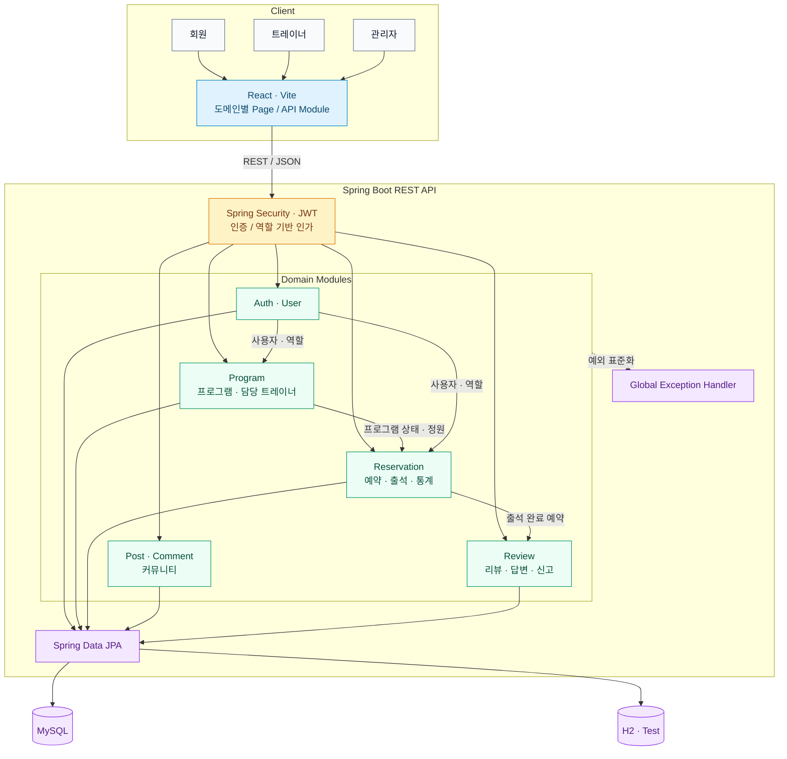
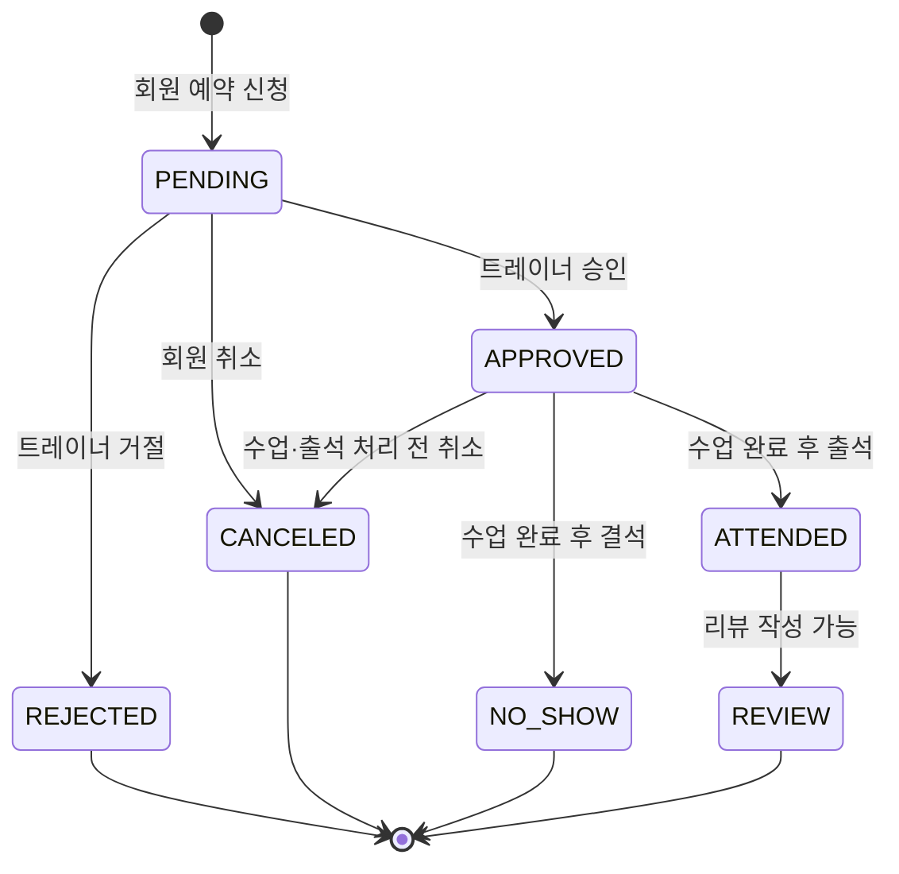

# Fitness Reserve

트레이너의 운동 프로그램 운영과 회원의 예약·출석·리뷰·커뮤니티 활동을 한곳에서 관리하는 팀 프로젝트입니다. Spring Boot 기반 REST API와 React 웹 클라이언트로 구성했습니다.

> 교육 과정 미니 프로젝트 · 3인 팀 · Backend/Frontend 통합

[주요 기능](#주요-기능) · [아키텍처](#아키텍처) · [팀 구현](#팀-구현-상세) · [실행 방법](#로컬-실행) · [테스트](#테스트)

## 프로젝트 배경

운동 프로그램의 개설부터 예약 승인, 출석, 리뷰까지 이어지는 흐름을 하나의 서비스에서 처리하는 것을 목표로 했습니다. 단순 CRUD에 그치지 않고 사용자 역할과 수업 상태에 따라 달라지는 예약 규칙을 서비스 계층에 구현하고 테스트했습니다.

### 핵심 사용자 흐름

1. 관리자가 회원 역할을 관리합니다.
2. 트레이너가 운동 프로그램을 개설하고 보조 트레이너를 배정합니다.
3. 회원이 프로그램을 조회하고 예약을 신청하거나 취소합니다.
4. 트레이너가 예약을 승인·거절하고 출석을 처리합니다.
5. 완료된 예약을 바탕으로 회원이 리뷰를 작성합니다.

## 주요 기능

- JWT Access/Refresh Token 기반 회원가입·로그인·로그아웃
- 관리자 회원 조회 및 역할 관리
- 운동 프로그램 등록·수정·조회와 담당 트레이너 배정
- 회원 예약·취소와 트레이너 출석 처리
- 프로그램 및 트레이너별 예약 통계
- 게시글·댓글 커뮤니티
- 리뷰·답변·신고와 관리자 검토

## 기술 스택

| 영역 | 기술 |
| --- | --- |
| Backend | Java 21, Spring Boot 4.1, Spring MVC, Spring Data JPA, Spring Security |
| Database | MySQL, H2(test) |
| Authentication | JWT (`jjwt`) |
| Frontend | React, Vite, Axios |
| Test | JUnit 5, Spring Security Test |
| Collaboration | Git, GitHub branch/PR workflow |

## 아키텍처



백엔드는 기능 중심의 도메인 모듈로 나누고 각 모듈 내부를 Controller–Service–Repository 계층으로 구성했습니다. 프론트엔드도 같은 도메인 단위로 페이지와 API 모듈을 분리해 팀원이 동시에 작업할 때 충돌 범위를 줄였습니다. 예약 도메인은 프로그램의 상태·정원과 연결되고, 출석이 완료된 예약만 리뷰로 이어지도록 서비스 계층에서 규칙을 검증합니다.

### 핵심 예약 흐름



## 팀 구성과 역할

역할은 저장소의 커밋 이력과 팀 작업 문서를 기준으로 정리했습니다.

| 팀원 | 담당 영역 | 주요 작업 |
| --- | --- | --- |
| 창민 (`H0ng`) | 인증·회원·관리자 | JWT 인증 필터, 회원가입·로그인·토큰 재발급·로그아웃, 회원 역할 관리, Spring Security 접근 제어, 인증 및 관리자 서비스 테스트, 인증·관리자 화면 |
| 박서희 (`superparkgit`) | 프로그램·예약 | 프로그램과 담당 트레이너 관리, 예약·취소·출석, 예약 통계, 상태별 비즈니스 규칙, 프로그램·예약 서비스 테스트, 프로그램·예약 화면 |
| 용재 (`YJ720`) | 커뮤니티·리뷰 | 게시글·댓글, 리뷰 작성·답변·신고·심사·평점, 관련 서비스 테스트와 화면, 게시글·리뷰 조회의 N+1 개선 |

## 팀 구현 상세

Git 커밋, 테스트 코드와 팀 작업 문서를 기준으로 각 담당 영역을 정리했습니다.

### 인증·회원·관리자 — 창민 (`H0ng`)

- JWT 발급·검증과 인증 필터, Spring Security 접근 제어 구성
- 회원가입·로그인·Access Token 재발급·로그아웃 구현
- Refresh Token 저장과 인증 사용자 정보 조회 구현
- 관리자 회원 목록 조회 및 역할 변경 기능 구현
- 인증·관리자 서비스 테스트와 로그인·회원가입·관리자 화면 구현
- 공통 예외 응답과 이메일·입력값 검증 정리

### 프로그램·예약 — 박서희 (`superparkgit`)

- 프로그램 CRUD와 주·보조 트레이너 배정 기능 구현
- 예약 신청·승인·거절·취소와 출석 처리 구현
- 프로그램 상태·정원·출석 여부에 따른 예약 비즈니스 규칙 적용
- 프로그램 및 트레이너별 예약 통계 API 구현
- 프로그램·예약 서비스 단위 테스트와 관련 React 화면 구현
- 트레이너 조회 API 및 담당별 프론트엔드 작업 구조 정리

### 커뮤니티·리뷰 — 용재 (`YJ720`)

- 게시글 CRUD·조회수와 댓글 CRUD·페이지네이션 구현
- 예약 기반 리뷰 작성·수정·삭제와 트레이너 답변 구현
- 리뷰 신고·관리자 심사·노출 상태 및 평점 집계 구현
- 게시글·댓글·리뷰 서비스 테스트와 관련 React 화면 구현
- 게시글·댓글·프로그램 조회의 N+1 문제 개선
- 댓글 일괄 삭제, 권한 검증과 예외 처리 보강

### 공통 협업

- 기능 브랜치와 Pull Request를 사용해 담당 도메인을 `main`에 통합했습니다.
- 공통 예외 처리, Security 권한 규칙과 도메인 간 API 계약을 함께 조정했습니다.
- 프론트엔드 페이지·API 모듈을 도메인별로 나눠 병합 충돌 범위를 줄였습니다.
- H2 기반 서비스 테스트와 MySQL 개발 환경을 분리해 각 기능을 검증했습니다.

## 구현하며 해결한 문제

- 인증·인가: JWT 인증과 역할별 API 접근 규칙을 공통 보안 계층에 적용했습니다.
- 예약 상태: 신청·승인·거절·취소·출석 상태 전이를 서비스 계층에서 검증했습니다.
- 도메인 연결: 완료·출석한 예약만 리뷰로 이어지도록 프로그램·예약·리뷰 조건을 연결했습니다.
- 조회 성능: 게시글·댓글·프로그램 조회 과정의 N+1 쿼리와 불필요한 반복 조회를 줄였습니다.
- 협업 충돌: 프론트엔드 라우팅, 페이지와 API 모듈의 담당 범위를 문서화했습니다.

## 구조

```text
src/main/java/com/mycom/myapp/domain
├── auth          # 인증과 Refresh Token
├── security      # Spring Security와 JWT
├── user          # 회원과 역할
├── program       # 운동 프로그램과 담당 트레이너
├── reservation   # 예약·출석·통계
├── post/comment  # 커뮤니티
└── review        # 리뷰·답변·신고

frontend/src
├── api            # 도메인별 API 모듈
├── auth           # 브라우저 인증 상태
├── pages          # 기능별 화면
├── routes         # 라우팅
└── components     # 공통 UI
```

## 로컬 실행

### 1. 준비

- JDK 21
- Node.js 20 이상
- MySQL 8

MySQL에 데이터베이스를 생성합니다.

```sql
CREATE DATABASE jpa_fitness;
```

### 2. 환경변수

실제 비밀번호와 JWT 서명 키는 저장소에 커밋하지 않습니다.

```bash
export DB_URL='jdbc:mysql://localhost:3306/jpa_fitness'
export DB_USERNAME='ureca'
export DB_PASSWORD='your-local-database-password'
export JWT_SECRET='replace-with-a-random-secret-at-least-32-bytes-long'
```

선택적으로 `docs/db/schema.sql`, `docs/db/data.sql`을 사용해 개발용 데이터를 준비할 수 있습니다.

### 3. Backend

```bash
./gradlew bootRun
```

기본 주소는 `http://localhost:8080`입니다.

### 4. Frontend

```bash
cd frontend
cp .env.example .env
npm install
npm run dev
```

## 테스트

```bash
./gradlew test
cd frontend
npm run lint
npm run build
```

백엔드 테스트는 H2와 테스트 전용 JWT 설정을 사용하므로 로컬 MySQL 없이 실행할 수 있습니다.

서비스 테스트는 다음 핵심 규칙을 검증합니다.

- 회원가입·로그인·토큰 재발급과 관리자 역할 변경
- 프로그램 생성·수정과 담당 트레이너 관리
- 예약 생성·취소·승인·거절 및 출석 상태 변경
- 게시글·댓글과 리뷰·답변·신고 처리

## 협업 방식

- 기능별 브랜치에서 작업하고 PR을 통해 `main`에 병합했습니다.
- 충돌이 잦은 라우팅·레이아웃·공통 API 파일의 담당 범위를 구분했습니다.
- 각 담당자는 자신의 도메인 화면과 API 모듈을 함께 관리했습니다.
- 상세한 프론트엔드 작업 규칙은 [`frontend/TEAM_WORK.md`](frontend/TEAM_WORK.md)와 [`frontend/TEAM_WORKFLOW.md`](frontend/TEAM_WORKFLOW.md)에 기록했습니다.

```text
feature/<domain>
      │
      ├─ 구현 및 테스트
      ├─ GitHub Pull Request
      └─ 리뷰·충돌 해결 후 main 병합
```

## 한계와 개선 방향

- 운영 환경별 설정 프로파일과 배포 자동화 추가
- Refresh Token 저장 정책 및 브라우저 토큰 보관 방식 강화
- 통합 테스트와 Controller 계층 테스트 확장
- Docker Compose 기반 MySQL 포함 실행 환경 제공
- API 명세와 화면 캡처 보강

## 보안 주의사항

- `.env`, DB 비밀번호, JWT secret은 Git에 올리지 않습니다.
- 공개된 적이 있는 비밀값은 재사용하지 않고 반드시 교체합니다.
- 이 저장소의 SQL 데이터는 예시 계정만 사용합니다.
